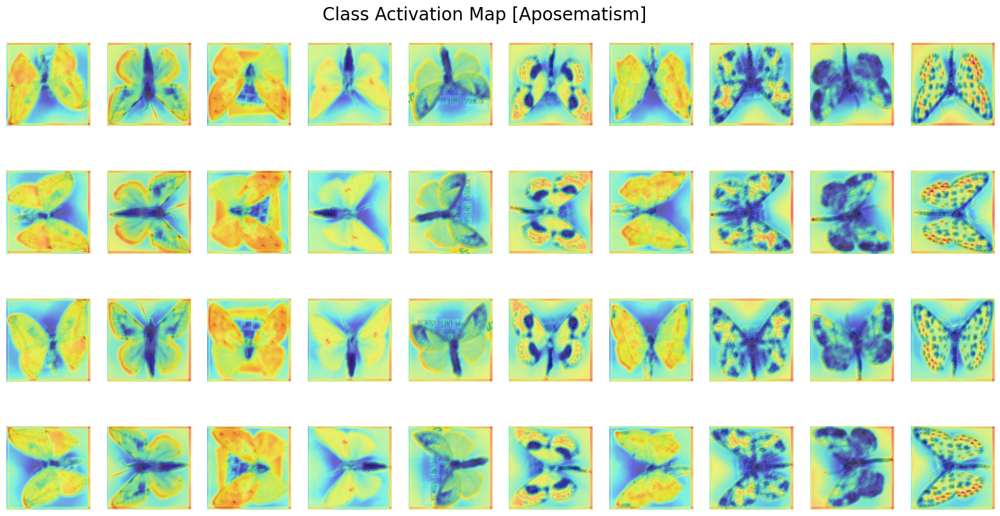

# moth-classification

This repository documents the results of a **graduation project** focused on classifying moths based on **camouflage** and **aposematism** using a **CNN model**.

### Project Overview

In ecological research, identifying whether a moth exhibits **camouflage** or **aposematism** is crucial for understanding its behavior and survival strategies. 
Traditional classification methods rely on various **physiological and ecological factors**, including:
- **Color contrast with the environment**
- **Presence of toxins**
- **Behavioral characteristics from early life stages**

However, these methods have limitations when dealing with species that have **limited available data**. 
This project explores whether classification can be performed using only **background images and moth images**, utilizing a **CNN model**.

The model architecture was inspired by the paper: **[PersonNet: Person Re-identification with Deep Convolutional Neural Networks](https://doi.org/10.48550/arXiv.1601.07255)**. 
This model processes two images through separate CNN layers, computes their **difference**, and classifies whether they belong to the same or different category. 
Similarly, our model calculates the **difference** between a background image and a moth image before performing classification.

### Installation

This project is implemented using **Python** and **PyTorch**. 
Ensure you have PyTorch installed before running the scripts.

To set up the environment, install the required dependencies:
```bash
pip install -r moth.txt
```

### Hardware Information
- **GPU Used:** NVIDIA GeForce RTX 3070

### Model Structure

The structure of the CNN model used in this project is shown below:


### Results

#### Class Activation Map (CAM) Results

The Class Activation Map (CAM) visualization highlights the regions of the moth image that contributed most to the classification decision.





